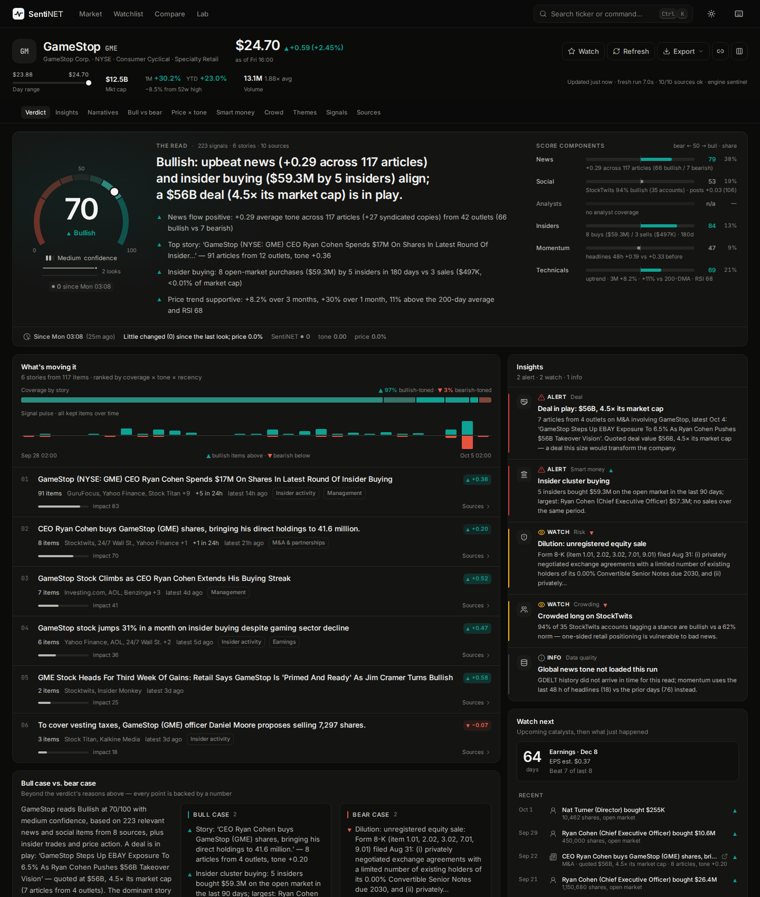
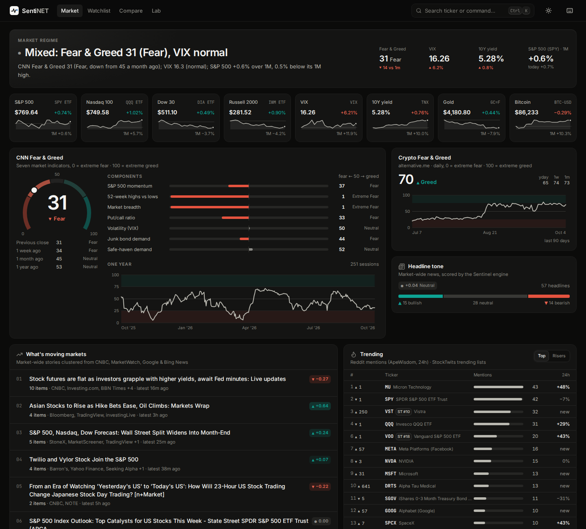

# SentiNET

**Market-sentiment intelligence, at a glance.** Type a ticker; in about ten seconds SentiNET reads
hundreds of live headlines and posts, plus analysts, insiders, filings, global news tone and price
action, and tells you what the market thinks of it, **why**, and **what to watch next**. Every claim
comes with the numbers behind it.

Free data only. No paid APIs and no API keys needed; free keys unlock extra sources. Nothing is ever
fabricated: when a provider is down or rate-limited, SentiNET says so instead of guessing.



---

## What you get

| | |
|---|---|
| **Verdict** | A 0–100 SentiNET score, its label (Strongly Bearish … Strongly Bullish), a confidence level, a one-line read, and the top reasons ranked by how much each moves the score. |
| **What's moving it** | Headlines and posts clustered into the stories that matter. Each story is ranked by coverage × tone × freshness and shows its outlet list, 24-hour velocity and a NEW flag versus your last visit. |
| **Insights** | Shown only when the evidence clears a threshold: news-vs-crowd and price-vs-sentiment divergences, attention spikes, crowded longs and shorts, tone reversals, analyst revision waves, clustered insider buying, legal and 8-K red flags, upcoming catalysts, and data-quality warnings. |
| **Bull case vs. bear case** | A brief whose every line carries a number. |
| **Smart money vs. crowd** | Analysts: consensus, price-target range and recent revisions. Insiders: open-market net flow. StockTwits: the author-tagged bull/bear ratio against its structural 62% norm. Reddit: mention rank and momentum. WSB: rank and comments. |
| **Catalysts** | Earnings date with estimate range and beat record, ex-dividend dates, rating changes and material SEC filings. |
| **Price × news tone** | Candles with event markers, 90 days of GDELT global news tone, and a lead/lag test of whether news tone has led this stock's price (with significance). |
| **Signal explorer** | Every kept item with its score, relevance, weight, syndication count and highlighted driver words, filterable and exportable as CSV or JSON. |
| **Market page** | Market regime, CNN Fear & Greed with its 7 components, crypto Fear & Greed, an indices strip, market-wide stories, and trending tickers on Reddit and StockTwits. |
| **Compare · Lab · Watchlist** | Compare up to 4 tickers side by side. Lab scores your own text or CSV with explanations. Watchlist keeps score history and alert rules (score thresholds, swings, attention spikes, new stories, analyst actions), with an optional Discord or Slack webhook. |



## How it works

```
                 ┌─────────────── concurrent, per-task timeouts, graceful degradation ───────────────┐
 ticker ─ resolve ┤  14 text/crowd sources   │  intel: quote · technicals · analysts · earnings ·     ├─▶ analytics ─▶ verdict, stories,
 (SEC + Yahoo)    │  (news + social)         │  insiders · SEC filings · GDELT tone · pageviews      │   (pure, deterministic)   insights, brief, catalysts
                 └───────────────────────────────────────────────────────────────────────────────────┘
                     │                                  NLP: relevance filter → syndication de-dup → Sentinel engine → themes · events → story clustering
                     └─▶ snapshots (SQLite) ─▶ "what changed", watchlist monitor, alerts
```

* **Relevance first.** Each item is scored for whether it is actually about the ticker: cashtags,
  exchange notation, case-aware brand names (Apple the company, not the fruit; SoFi, not SoFi
  Stadium), share-class siblings and ETF themes. Off-topic items are dropped, and listicles and
  roundups are discounted.
* **Syndication collapse.** The same wire story in 15 outlets counts as one item with 15× reach,
  not as 15 votes.
* **The Sentinel engine** is a finance-specific sentiment model. It combines a hand-built lexicon
  of about 2,200 entries, about 3,400 counting inflections (Loughran-McDonald-style finance
  vocabulary plus trader slang and emoji), with a rule layer: analyst actions with price targets, beats and misses against consensus,
  guidance, price moves sized by magnitude, negation, contrast, hedges and questions. VADER is
  added for social text. It is deterministic, explainable (driver words per item), CPU-only and
  scores about 5,000 texts per second. FinBERT, local or via the Hugging Face API, can be blended
  in optionally.
* **The composite** has six components: news 30%, social 15%, analysts 20%, insiders 10%,
  momentum 10% and technicals 15%. Each component is measured against its empirical baseline:
  headline tone skews positive, and StockTwits skews bullish. Weights are renormalized over the
  components that are available and scaled by each one's confidence, and small samples are shrunk
  toward neutral.

### Sentiment engine benchmarks

Accuracy and macro-F1 on public, human-labeled finance datasets. The held-out sets were never used
for tuning: tuning used only the Twitter train split and half of a StockTwits sample.

| Dataset (held-out) | VADER (the v1 engine) | **Sentinel** |
|---|---|---|
| Twitter Financial News — validation (2,388) | 49.4% / 0.447 | **80.9% / 0.770** |
| Financial PhraseBank — AllAgree (2,264) | 57.1% / 0.487 | **88.6% / 0.861** |
| FiQA posts (675) | 39.6% / 0.339 | **70.4% / 0.567** |
| FiQA headlines (425) | 47.8% / 0.457 | **50.6% / 0.525** |
| StockTwits, author-tagged (1,159; share labeled / accuracy on those) | 58% / 70.5% | **59% / 83.3%** |

Reproduce with `python -m scripts.eval_engine` (it downloads the datasets to `~/.cache/sentinet`;
nothing is committed). Full results: `backend/tests/nlp/data/engine_eval_results.json`.

## Data sources

| Source | Kind | Key | What it contributes |
|---|---|---|---|
| Google News (RSS) | news | — | Headline search across thousands of outlets (24-hour and 7-day windows) |
| Bing News (RSS) | news | — | Second news index, each item checked for an asset mention |
| Yahoo Finance | news | — | Ticker-tagged headlines (via yfinance) |
| Seeking Alpha (RSS) | news | — | Symbol news and analysis feed |
| Nasdaq (RSS) | news | — | Symbol news feed |
| StockTwits | social | — | Symbol stream with author-tagged Bullish/Bearish stances |
| Bluesky | social | optional | Cashtag search (an app password improves reliability) |
| Hacker News (Algolia) | social | — | Tech-audience discussion |
| ApeWisdom | crowd | — | Reddit mention counts, rank and 24-hour change |
| Tradestie | crowd | — | r/wallstreetbets top-50 rank and comments |
| Finnhub · Marketaux · Alpha Vantage | news | free key | Ticker-keyed news, with daily quota tracking |
| Reddit (OAuth) | social | approved app | Only with existing credentials; keyless Reddit JSON has returned 403 since May 2026 |
| Yahoo Finance (yfinance) | intel | — | Quote, history, technicals, analysts, price targets, upgrades/downgrades, earnings, insider trades, symbol search |
| SEC EDGAR | intel | — | Ticker→CIK map and recent filings, with 8-K items decoded and flagged |
| GDELT DOC 2.0 | intel | — | 90-day global news tone and volume (strictly 1 request per 5 seconds) |
| Wikipedia pageviews | intel | — | Attention baseline |
| CNN Fear & Greed · alternative.me | market | — | Market and crypto regime |

Every provider call goes through one rate-limited HTTP client (per-host spacing, retries,
contact-bearing User-Agents where an API's policy requires one). Calls are cached with
single-flight, so ten users opening the same ticker cost one upstream request.

## Quick start

**Docker** (one container serves the API and the web app):

```bash
docker compose up -d --build        # → http://localhost:8000
```

**Local:**

```bash
make setup      # backend venv + frontend deps; creates backend/.env (all settings optional)
make dev        # API on :8000 with reload + Vite on :5173 (proxies /api)
make serve      # production build of the web app, served by the API on :8000
```

**CLI:**

```bash
cd backend && source .venv/bin/activate
python -m app analyze NVDA          # rich terminal brief (add --json for the full payload)
python -m app market                # regime, fear & greed, indices, trending
python -m app sources               # which sources are on, and which need a key
```

## Configuration

Everything is optional; see `backend/.env.example`, which documents each setting and where to get
each free key.

| Setting | Purpose |
|---|---|
| `CONTACT_EMAIL` | Contact for the User-Agent that SEC EDGAR and Wikimedia ask for (set this to yours) |
| `FINNHUB_API_KEY`, `MARKETAUX_API_KEY`, `ALPHAVANTAGE_API_KEY` | Extra ticker-keyed news sources (free tiers) |
| `BLUESKY_HANDLE`, `BLUESKY_APP_PASSWORD` | Authenticated Bluesky search |
| `SENTIMENT_ENGINE` | `sentinel` (default), `finbert` (local transformers) or `finbert-api` (needs `HF_TOKEN`) |
| `MONITOR_ENABLED`, `MONITOR_INTERVAL_MINUTES`, `ALERT_WEBHOOK_URL` | Background watchlist refresh and alert delivery |
| `DISABLED_SOURCES` | Comma-separated source keys to turn off |
| `*_CACHE_TTL`, `SOURCE_TIMEOUT`, `INTEL_TIMEOUT` | Caching and timeouts |

## API

Interactive docs at `/docs`. All routes live under `/api`:

| Endpoint | |
|---|---|
| `GET /analyze/{ticker}` · `GET /analyze/{ticker}/stream` | Full analysis; the stream is Server-Sent Events with per-source progress, then the result |
| `GET /price/{ticker}?range=1D…5Y` · `GET /history/{ticker}?days=90` | Candles · tone × price history with lead/lag stats |
| `GET /market` · `GET /search?q=` | Market overview · symbol search |
| `POST /lab/score` | Score up to 500 texts, with drivers, themes and events |
| `GET/POST/DELETE /watchlist` · `GET /snapshots/{ticker}` | Watchlist and stored score history |
| `GET/POST/DELETE /alerts` · `GET /alerts/events` · `GET /monitor` | Alert rules, fired events, monitor status |
| `GET /export/{ticker}.csv` · `.json` | Signals of the latest analysis |
| `GET /health` · `GET /sources` | Status and source configuration |

## Development

```bash
make test       # offline backend suite (recorded real payloads; no network)
make test-live  # smoke tests against the real providers
make lint       # ruff + TypeScript typecheck
cd frontend && npm run screens   # Playwright screenshots of every page (fixtures)
cd frontend && npm run smoke     # interaction checks
```

Layout: `backend/app/sources` (text and crowd sources), `intel` (market data, SEC, GDELT,
attention, market overview), `resolve` (tickers and names), `nlp` (engine, relevance, themes,
events, story clustering), `analytics` (the verdict, insights, brief, history and market regime),
`services` (orchestrator, monitor), `storage` (SQLite), `api`. Frontend: `frontend/src/features/*`
(intel, market, compare, lab, watchlist).

## Honest limits

* Google News, Bing, Seeking Alpha, Nasdaq, StockTwits, CNN and Yahoo are free but unofficial
  endpoints. They can throttle or change without notice; SentiNET degrades and reports it.
* GDELT allows one request every 5 seconds per IP, so news-tone history can arrive a refresh later.
* Sentiment is a reading of what people are saying, not a forecast. **Not investment advice.**
